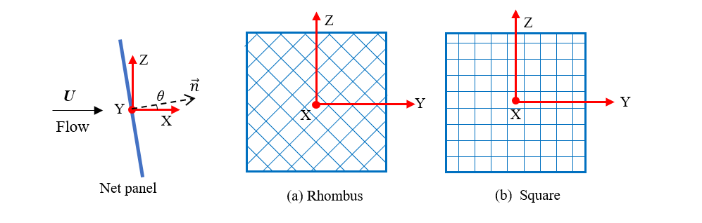

## Guide for input file  --- netPanel(s)



There are some assumptions when we generate mesh for simulations:

* Although the flow direction can be change in the **Environment**, we assume the X+ is the flow direction when we generate the mesh.
### MeshLib

**MeshLib** is used to tell the mesh generator which library will be used to generate mesh.
The value is used in the net panel(s) is ```panel```.
    
### Environment 

The information about the environmental conditions.  
1. **current**: a python list. Unit: [m/s]. 
    
    -  One velocity,  ```[[u,v,w]]```.  Input the three components of the current velocity that you are indented to use.     
    -  Multiple velocities,  ```[[u1,v1,w1],[u2,v2,w2],[u3,v3,w3]...[un,vn,wn]]``` . Input the current velocities as a list of velocity. The program will run each velocity within the given timeLength sequentially.    
  
2. **waterDepth**:  a floating point number. Unit: [m]. The depth of water. 
  
3. **waves**:  a python list or "False".

    - If there is no wave, please use ```False``` to disable it. 
    - If wave are applied to the environment, Please use ```[wave height, wavelength]``` to define a deep water airy wave. Unit: [m] 
 
4. **fluidDensity**: a floating point number. Unit: [kg/m^3]. The density of fluid, sea water: 1025, fresh water: 1000.

### Net
Define the netting of net panel(s) 

1. **HydroModel**: a string to indicate the hydrodynamic model. A detailed explanation can be found later.   
    - Screen model: ```Screen-S1```,```Screen-S2```,```Screen-S3```...  
    - Morison model: ```Morison-M1```,```Morison-M3```,```Morison-M3```...

2. **nettingType**: a string to indicate the netting type. 
    - ```square```: square netting that are commonly used in aquaculture cage
    - ```rhombus```: rhombus netting that are commonly used in fishing gear, e.g., trawl net, purse seine.
  
3. **normalVector**: a python list. Unit: [-].
    - Single net panel, ```[[nx,ny,nz]]```. Input the three components of the normal vector. The norm of vector do not need to be one.
    - multi net panels, ```[[nx1,ny1,nz1],[nx2,ny2,nz2]...]```. Input the three components of the normal vectors. The sequence of the input file should be corresponding to the **barCenter**
 
4. **netHeight**:a floating point number. Unit: [m]. The height of net panels. Here, we assume that all the net panel have the same geometrical characterises.  

5. **netWidth**:a floating point number. Unit: [m]. The width of net panels. Here, we assume that all the net panel have the same geometrical characterises.

7. **elementOverHeight**: a integer number. Unit: [-]. The element that along the height of net panel. 

6. **elementOverWidth**: a integer number. Unit: [-]. The element that along the width of net panel.

8. **Sn**: a floating point number. Unit: [-]. The solidity ratio of netting. 

9. **twineDiameter**: a floating point number. Unit [m]. The diameter of twine in the physical netting.

10. **meshLength**: a floating point number. Unit [m]. The half mesh length of the physical netting. 

11. **netYoungmodule**: a floating point number. Unit [Pa]. The Young's modulus of netting.

12. **netRho**: a floating point number. Unit: [kg/m^3]. The density of the netting.

### TopBar

Define the top bar of net panels. 

1. **barCenter**:a python list. Unit: [m].
    -  One net panel,  ```[x,y,z] ```.  Input the position of the top bar center.                                                  
    -  Multiple net panels,  ```[[x1,y1,z1],[x2,y2,z2],[x3,y3,z3]...[xn,yn,zn]]``` . If there are multiple net panels, input the position of each top bar center and make it a python list.

2. **barRadius**: a floating point number. Unit [m]. The pipe diameter of the top bar.

3. **topBarRho**: a floating point number. Unit [kg/m^3-]. The effective density of top bar. 

4. **topBarYoungModule**: a floating point number. Unit [Pa]. The Young's modulus of top bar.

### Weight
Define the weight system of cage. 
1. **weightType**: a string to indicate the weight type. 
    - ```sinkers```: conventional type, numbers of sinkers are hung at the bottom of fish cage
    - ```allfixed```: all the nodes are fixed. Thus, the fish cage have no deformation. 
    - ```tube```: Using sinker tube to keep stretch the net panel. 

2. **bottomBarRadius**: a floating point number. Unit [m]. The pipe diameter of the sinker tube.
 
3. **bottomBarRho**: a floating point number. Unit [kg/m^3-]. The effective density of floater collar. 
      
4. **bottomBarYoungModule**: a floating point number. Unit [Pa]. The Young's modulus of floater collar.
                 
5. **numOfSinkers**: a integer number. Unit: [-]. The number of sinker.

6. **sinkerWeight**: a floating point number. Unit [N]. The submerged wight of each sinker.

### Solver
Define the solver of simulation
 
1. **version**: a string to indicate the version of code_Aster. You can use the following type:
```stable```, ```testing```.
  
2. **coupling**: a string to indicate the whether or not using coupling.
    - ```False```: No coupling. Calculated only with Code_Aster
    - ```FSI```:  Fully couple with OpenFoam. 
    - ```simiFSI```: Semi coupled, only transfer the value from code_aster to OpenFOAM

3. **method**: a string to indicate the method to solve the equation. 
```HHT```: hht-alpha method. 

4. **alpha**:a floating point number for alpha in hht-alpha method.
```24.3``` is the default number for netting. 

5. **timeStep**: a floating point number. Unit [s]. The time step for simulations, usually between 0.2-0.01.

6. **timeLength**: a floating point number. Unit [s]. The length of time for the simulation with each current velocity. Usually, 10 s is enough to reach equilibrium. 

7. **MaximumIteration**: a integer number. Unit: [-]. The number of iteration at each time step, the default value is ```1000```.

8. **Residuals**: a floating point number. Unit [-]. The threshold for the maximum of residual.


